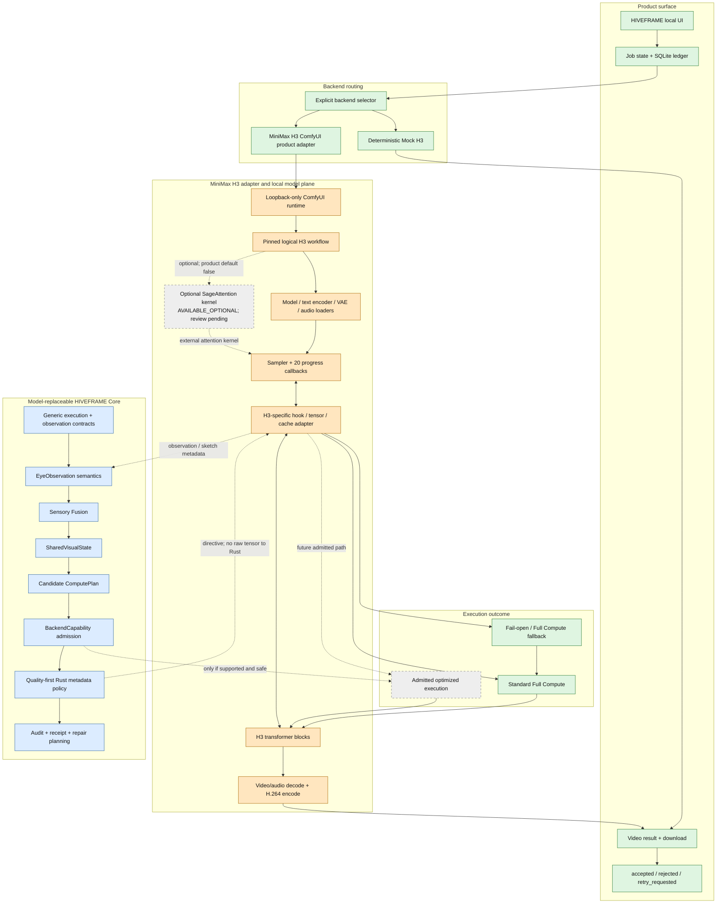
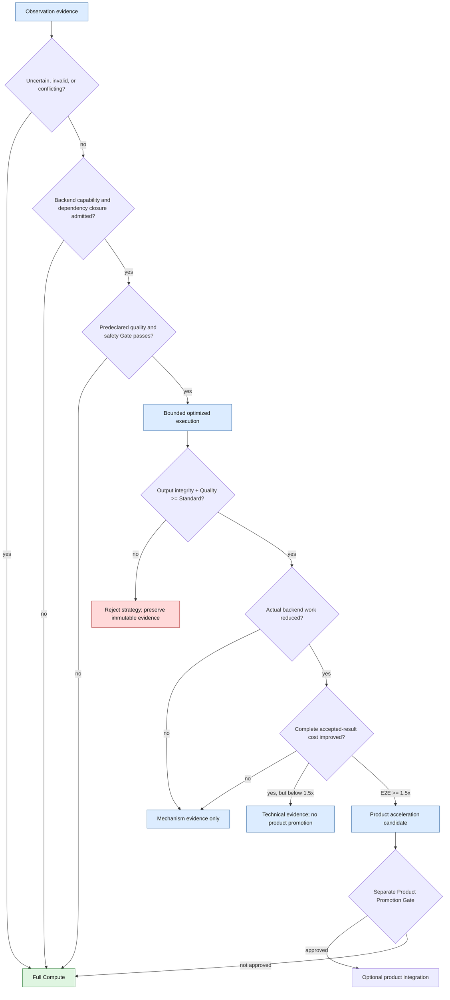
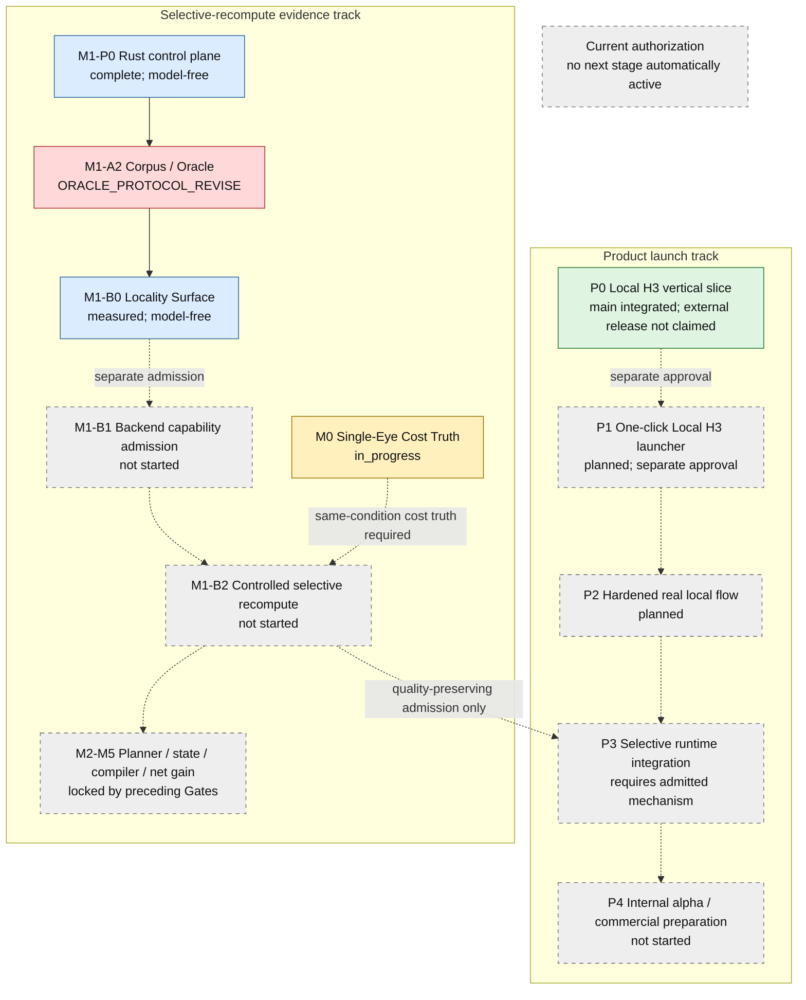

# HIVEFRAME Living System Map

Status: living architecture map

Snapshot date: 2026-08-10

Verified source `main`: `1d339f5966c89fc66bf59d025bce3d2a1d289bf5`

This document visualizes the current product path, Core/adapter ownership,
selective-execution safety flow, and published H3 mechanism evidence. It must
be updated in the same change whenever architecture, data flow, module
ownership, capability admission, fallback, active stage, or a bounded decision
changes. A task with no structural impact records `diagram impact: none`
instead of rewriting the map.

## Legend

- solid arrow: implemented or verified current flow;
- dashed arrow: candidate, planned, or separately approved experimental flow;
- green node: current safe/product path;
- blue node: generic HIVEFRAME contract or control component;
- orange node: model-specific adapter/runtime component;
- red node: rejected or not-admitted strategy;
- gray node: planned and not started.

## 1. Product and runtime structure

The solid product path is Local UI -> explicit backend -> loopback ComfyUI ->
Full Compute H3 -> decoded/encoded video -> result and feedback. The selective
path is not a product default. Generic Core exchanges only contracts,
capabilities, digests, scalar/sketch metadata, and directives; H3 tensors and
execution details remain in the adapter.

SageAttention is an external optional H3 attention-kernel component. A0 reused
the immutable F0 pair and passed a fixed automatic catastrophic-regression
screen, but human visual review remains pending. It is therefore drawn as a
dashed optional route, with product default false and no integrated speedup or
quality-parity claim. The solid Standard Full Compute path is unchanged.

## 2. Quality-first selective decision flow

`QUALITY FAILURE OVERRIDES SPEEDUP`. Observation never authorizes skip by
itself. Full Compute remains independently available at every decision point.

## 3. Current bounded roadmap

Arrows between completed research entries show chronology, not automatic Gate
passage. Every dashed transition requires a separately approved product
question. M0 remains open even though later model-free evidence exists, and
P3 cannot begin merely because an execution hook or opportunity was observed.

## 4. Current H3 Core-evidence progression

```mermaid
flowchart LR
    C0["C0 Phase / Hook Map\nverified_once"]
    C1["C1 Rust callback bridge\n20 Full Compute directives"]
    C2["C2 Shadow Policy\nREADY; Full Compute only"]
    C3["C3 policy opportunity\n14.8% < 18%"]
    R1["C3-R1 Identity Bypass\n148 real block omissions"]
    R1Q["Quality Gate failed\nnot product-admitted"]
    R2["C3-R2 Residual Capture\n20 captures"]
    R2G["0 calibrated targets\nSELECTIVE not run"]
    R3["C3-R3 Compact Correction\n0 calibrated targets"]
    R3G["Predictor similarity Gate failed\nSELECTIVE not run"]
    R4["C3-R4 Directional Prediction\n0 calibrated targets"]
    R4G["Residual predictor family\nfallback-only"]
    C4["C4-S0 Sub-block Cost Surface\nFull Compute measurement"]
    C4A["Global attention 70.22%\nkeep Full Compute"]
    C4F["Feed-forward positionwise 19.49%\nbounded candidate"]
    C4S1["C4-S1 FF token CONTROL shadow\nFull Compute output valid"]
    C4S1G["Instrumentation comparison failed\n+6.34%; SELECTIVE not run"]
    C4S1R1["C4-S1-R1 minimal telemetry\nFull Compute output valid"]
    C4S1R1G["Comparison still failed\n+6.47%; selector fallback-only"]
    A0["A0 SageAttention component\nhistorical 1.207x; screen passed"]
    A0G["KEEP_AS_OPTIONAL\nhuman review pending; default false"]
    A1["A1 Active-Q CONTROL\nsubset-Q/global-KV structurally admitted"]
    A1G["Rust p95 + block Gate failed\nSELECTIVE not run; fallback-only"]
    DEFAULT["Current default\nFull Compute\nproduct speedup claim = 0"]

    C0 --> C1 --> C2
    C2 -. "separate approval" .-> C3
    C3 -. "separate approval" .-> R1
    R1 --> R1Q
    R1Q -. "separate approval" .-> R2
    R2 --> R2G
    R2G -. "separate approval" .-> R3
    R3 --> R3G
    R3G -. "separate approval" .-> R4
    R4 --> R4G
    R4G -. "separate approved measurement" .-> C4
    C4 --> C4A
    C4 --> C4F
    C4F -. "separately approved C4-S1" .-> C4S1
    C4S1 --> C4S1G
    C4S1G -. "single approved REVISE_ONCE" .-> C4S1R1
    C4S1R1 --> C4S1R1G
    C4A -. "separate external component review" .-> A0
    A0 --> A0G
    C2 -. "separately approved A1" .-> A1
    C4A -. "global K/V retained" .-> A1
    A1 --> A1G
    R1Q --> DEFAULT
    R2G --> DEFAULT
    R3G --> DEFAULT
    R4G --> DEFAULT
    C4A --> DEFAULT
    C4S1G --> DEFAULT
    C4S1R1G --> DEFAULT
    A0G --> DEFAULT
    A1G --> DEFAULT

    classDef verified fill:#dcecff,stroke:#2d65a3,color:#111;
    classDef rejected fill:#ffd9d9,stroke:#ad2e2e,color:#111;
    classDef safe fill:#dff5e1,stroke:#287a34,color:#111;
    classDef planned fill:#eeeeee,stroke:#777,color:#111,stroke-dasharray: 5 5;
    class C0,C1,C2,R1,R2,C4,C4S1,C4S1R1,A0,A1 verified;
    class C3,R1Q,R2G,R3,R3G,R4,R4G,C4S1G,C4S1R1G,A1G rejected;
    class C4A,C4F,A0G planned;
    class DEFAULT safe;
```

C4-S0 decomposes one unchanged Full Compute run into six source-backed H3
adapter timing groups. It does not admit selective execution. Global attention
remains Full Compute because it is dominant but globally coupled. The selected
future bounded lever is a mixed strategy that preserves attention and examines
the positionwise feed-forward surface only after separate approval and a new
Quality-First admission contract.

C4-S1 implemented that bounded adapter contract and completed one Full Compute
CONTROL shadow, but its 519.822272-second sampler was 6.336324% slower than the
immutable C4-S0 comparator and exceeded the fixed +/-5% band. No policy
received compute authority and SELECTIVE did not run. This is an
instrumentation-comparability stop with `REVISE_ONCE`, not a rejection of the
entire feed-forward surface. Full Compute remains the current default.

C4-S1-R1 consumed that single revision. It removed measurement-only per-block
events, synchronization, histogram, CONTROL host reads, and resource polling,
while retaining the exact selector-required scalar and history work. Its
520.488870-second sampler remained 6.472686% above the immutable C4-S0
reference, so comparability failed again. Official policy admission and
SELECTIVE did not run. The exact selector is now fallback-only with no
automatic R2; the independent feed-forward cost surface remains unadmitted
evidence for a separately approved mechanism. Global attention remains Full
Compute, and product speedup claim remains zero.

A1 then connected the live C2 48-value sketch to a new metadata-only Rust
region plan and an H3 adapter whose structural tests admit smaller post-RoPE Q
against full/global K/V. One Full Attention CONTROL output remained comparable
and valid. The immutable Rust boundary p95 was exceeded and no block passed the
fixed regional attention-impact Gate, so SELECTIVE did not run. The exact
zero-update mechanism is fallback-only; this does not reject the global
attention cost surface or A0's independent optional kernel evidence. Standard
Full Compute remains the solid product path.

## 5. Module ownership

| Layer | Owns | Must not own or claim |
|---|---|---|
| Product | UI, jobs, results, feedback, explicit backend provenance | Silent Mock fallback or implicit training consent |
| Generic Core | observation/state semantics, candidate plan, capabilities, invalidation, dependency closure, quality policy, fallback, telemetry, repair/cost accounting | H3 paths, tensor layouts, block counts/ranges, node IDs, filenames |
| Rust policy | fixed-size metadata validation and deterministic directives | Raw model tensors, CUDA pointers, prompts, weights, model-specific classes |
| H3 adapter | ComfyUI workflow mapping, H3 tensor/block/hooks/cache, model-specific admission and fallback | Reinterpretation of model-specific evidence as a generic capability |
| Model plane | loader, conditioning, sampler, transformer, VAE/audio, encode | Product speedup claim without complete-cost and quality evidence |
| Evidence | receipts, source hashes, thresholds, decisions, worklogs | Post-result Gate changes or overwritten failures |

## 6. Diagram maintenance contract

Every task must answer `diagram impact` before commit:

- `updated`: architecture, data flow, module ownership, capability/fallback,
  active stage, or bounded decision changed; update this file in the same
  commit and cite the evidence.
- `none`: no structural or state-flow impact; record the reason in the detailed
  worklog or final report and do not churn the diagram.
- `blocked`: the task exposes a structure conflict or unverified transition;
  preserve the current diagram and request approval rather than drawing the
  proposed path as verified.

Diagram arrows and states must reflect evidence status. Planned, candidate,
rejected, unsupported, and verified flows remain visually distinct. Updating
the diagram never authorizes a Generation, benchmark, threshold change,
backend integration, model download, or next research stage.
