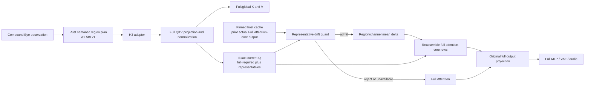

# A3 H3 Attention-output reuse correction contract

Status: frozen model-free structural contract
Mechanism: `REGIONAL_ATTENTION_OUTPUT_REUSE_WITH_CORRECTION_V1`
Correction: `REGION_CHANNEL_MEAN_DELTA`

## Product question

Can the H3 adapter omit current attention-core Q rows for stable regional
interiors, reuse the previous actual Full Attention-core output, and correct
that cache from current exact representative rows without weakening
Quality-First fail-open behavior?

This is an experimental adapter capability. It is disabled by default. H3 is
the production backend, while all tensor layout, block identity, CUDA transfer,
and cache ownership remain inside the H3 adapter. Generic HIVEFRAME Core owns
only Stable/Active/Uncertain semantics, anchors, invalidation, reason codes,
and Full Compute fallback.

## Frozen data path

The cache source is actual Full Attention-core output only. Selective or
corrected output never becomes a source. Cache age is exactly one source
interval, and a reused block/region must be refreshed by Full Attention before
another reuse. Active, Uncertain, Halo, Anchor, missing, stale, late, nonfinite,
or layout-mismatched states are Full Compute.

## Bounded storage

The fixed H3 attention-core width is 7,168. The four exclusive regional
interiors contain 12,025 rows. BF16 worst-case cache storage is therefore
172,390,400 bytes per candidate block. A 2 GiB cap admits at most 12 of the
ranked maximum 16 blocks. One-block GPU staging is also 172,390,400 bytes,
below the 256 MiB target. At least three blocks are required.

Candidate ordering reuses the immutable A2 full block-level ranking:

1. mean normalized L2 ascending;
2. mean cosine descending;
3. p95 normalized L2 ascending;
4. block index ascending.

If the private ranking is unavailable or its digest is inconsistent, the
fallback is block 0 followed by ascending block index, and it must not be
described as a fidelity ranking.

## Current structural blocker

The fixed runtime guard compares current exact representatives with cached
representatives. Reuse is permitted only at cosine at least 0.97, normalized
L2 at most 0.25, with no nonfinite values. Failure requires same-block,
same-region Full Attention.

The current PyTorch/ComfyUI adapter cannot use a CUDA scalar result to
conditionally dispatch that same-block Full Attention without one of these
contract violations:

- `.item()`, `bool(tensor)`, or equivalent blocking host synchronization;
- unconditional Full Attention followed by a GPU selection, which yields no
  actual omitted-Q reduction;
- deferring the guard, which removes the current-block fail-open guarantee.

For that reason the present capability records
`A3_ATTENTION_OUTPUT_REUSE_STRUCTURALLY_NOT_ADMITTED`, consumes no Generation
budget, and keeps Standard Full Compute independently callable. Cache capacity
is admitted; device-side conditional execution authority is not.

A future revision may investigate a GPU-native conditional-dispatch hook or a
separately approved pre-admission contract. Neither change is silently folded
into A3 V1.

## Claim boundary

- A3 selective execution: not executed.
- Model load, Generation, and CUDA execution for this admission: zero.
- Actual attention work reduction: not collected.
- Quality comparison: not collected.
- Speedup claim: zero.
- Quality or product promotion: zero.
- Full Compute fallback and existing product route: preserved.
