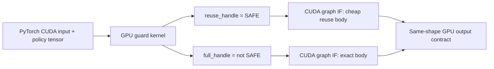

# A3-G0 GPU-native conditional omission contract

Status: frozen synthetic execution-authority gate

Mechanism: `GPU_NATIVE_CONDITIONAL_KERNEL_OMISSION_V1`

## Product question

Can the current Windows Local H3 PyTorch CUDA stack let a GPU guard choose
between a cheap reuse body and an exact body without a host guard read, while
retaining a bit-exact exact fallback?

This is a bounded primitive, not H3 attention integration. It uses synthetic
`torch.int32` CUDA tensors and does not load a model or generate video.

## Frozen execution island

The extension uses the current PyTorch CUDA device, context, and stream. It
creates no second CUDA context. The fixed topology contains two conditional
IF nodes controlled by complementary handles. Exactly one body must execute.
Any value other than the one explicit SAFE value fails closed to the exact
body.

All tensors and counters are allocated before graph launch. Conditional bodies
contain no allocation or free operation. The hot path contains no `.item()`,
`bool(tensor)`, CPU tensor materialization, D2H guard read, or explicit CPU
synchronization. One final stream synchronization is permitted only after all
four launches so evidence can be read.

## Frozen gates

The single replay sequence is `SAFE, UNSAFE, SAFE, UNSAFE`.

- SAFE: reuse body count increments, exact body count does not, and output is
  bit-exact to an independently executed reuse-reference kernel.
- UNSAFE: exact body count increments, reuse body count does not, and output
  is bit-exact to a standalone exact-control kernel.
- Replay: cumulative counts are 2/2 and branch history has no state leak.
- Integration: input is a current-device PyTorch CUDA tensor on the current
  PyTorch stream, with no redundant tensor copy or separate context.

Device counters are body-execution evidence. Without a profiler they are not
described as directly measured CUDA kernel-launch counts.

## Claim boundary

- Actual H3 attention reuse or omission: zero.
- Model load and video Generation: zero.
- Product speedup claim: zero.
- Quality success and product promotion: false.
- Default product route: unchanged Standard Full Compute.

Only a passing synthetic gate may expose the capability as experimental and
disabled by default. Real A3 correction integration remains a separately
approved A3-G1 task.
