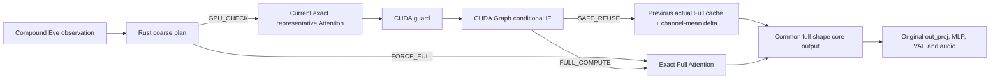

# A3-G1 real H3 conditional attention reuse contract

Status: predeclared experiment contract; disabled by default

## Product question

Can HIVEFRAME reduce actual MiniMax H3 Attention-core query work, retain the
Standard Full Compute fallback and automatic quality, and reduce accepted-run
sampler and submit-to-terminal time?

G1 does not require or claim the final 2× product target. It may run one
CONTROL and, only after every frozen opportunity Gate passes, one SELECTIVE.
There is no retry budget.

## Authority boundary

The existing A1 Rust ABI emits metadata only. The H3 adapter maps it to either
`FORCE_FULL` or `GPU_CHECK`; Rust never authorizes reuse. A CUDA boolean scalar
is the final block-level authority. All eligible Stable-region guards must pass
for `SAFE_REUSE`. Any uncertainty, nonfinite value, stale cache, source/layout
mismatch, native error, or graph error resolves to exact `FULL_COMPUTE`.

Observation is not compute authority. `UNCERTAIN` remains Full Compute.

## Exact execution island

The admitted candidate is
`PYTORCH_CUDAGRAPH_CONDITIONAL_IF_EXACT_SDPA_V1`. The installed Standard H3
backend is `attention_pytorch`, whose exact core is PyTorch SDPA. PyTorch
2.12/CUDA 13 exposes CUDA Graph conditional-node capture. Branch GraphModules
are traced with fake tensors, so graph construction does not execute a hidden
Full Attention kernel. The selected branch runs on the current PyTorch CUDA
stream and returns one common output tensor.

CUDA Graph operands have fixed addresses. G1 does not copy the full Q/K/V
tensor into a second staging area and does not recapture on the hot path. A
pointer, shape, stride, dtype, device, or backend mismatch therefore uses the
unmodified Full Attention function. This fail-open restriction is part of the
evidence, not an implementation detail to hide.

CONTROL permits one duplicate exact Attention-core call at one fixed parity
sample only. The native Full branch must match the original output in shape,
dtype, device, finiteness, and every bit. The rest of CONTROL gathers
representatives from its already-computed full output; it must not run a second
subset Attention workload.

## Cache and correction

Only `ACTUAL_FULL_ATTENTION_CORE_OUTPUT` may populate the cache. Cache age is
exactly one source interval. Reused or corrected output never becomes a cache
source, and every attempted GPU check invalidates its source so consecutive
approximation is impossible.

The existing A3 limits remain fixed: at most 2 GiB pinned host cache, an 8 GiB
host safety reserve, at most 16 candidates, at least 3 cache-capable blocks,
and at most 256 MiB of GPU staging. The cache stores fixed regional-interior
rows. The correction remains `REGION_CHANNEL_MEAN_DELTA`; no alternate
predictor or threshold tuning is permitted.

## Work accounting

Receipts separately record theoretical full Q rows, actual current Q rows,
representative/required rows, conditionally executed Full Q rows, reused
omitted rows, exact/reuse body counts, cache hits and misses, H2D/D2H bytes,
GPU staging, guard D2H bytes, host guard reads, and explicit hot-path CPU
synchronization. Computing Full Attention and discarding its rows is not an
omission. Actual admission requires at least 3% fewer current Q rows and a
positive reused-row count.

K and V remain global and full. QKV projection, original output projection,
MLP, VAE, and audio remain full. Sage, residency, prefetch, CUDA-complete
blocks, training, and product-default changes are out of scope.

## Frozen Gates

CONTROL block admission requires at least three valid observations, mean/p05
cosine of 0.980/0.950, mean/p95 normalized L2 of at most 0.120/0.250, energy
ratio in 0.85–1.15, no nonfinite value, and corrected mean L2 no worse than the
raw cache. A representative guard that says safe while corrected omitted rows
fall below 0.950 cosine, exceed 0.250 normalized L2, or become nonfinite is a
false-safe. The allowed false-safe count is zero.

SELECTIVE additionally requires bit-exact native Full parity, at least three
admitted blocks, at least 3% planned Q reduction, at least three affected
non-anchor steps, at least three Stable plan events, at least three cache slots,
valid output, callback p95 at most 3 ms, no tensor sent to Rust, and no per-block
or per-token Rust call.

Automatic paired quality requires mean/p05/min SSIM of 0.95/0.90/0.85,
SSIM-below-0.85 rate at most 0.02, normalized MAE at most 0.03, and motion,
gradient, and temporal ratios in 0.90–1.10. Human equivalence remains pending.

An accepted G1 component must also reduce both sampler and submit-to-terminal
time. Even then it remains optional pending human review; it is not a product
default and does not establish the final 2× target.
