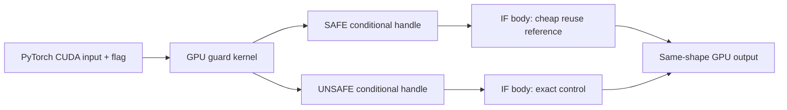

# A3-G0 GPU-Native Conditional Kernel Omission Primitive

Date: 2026-08-10

Status: Draft PR evidence complete; not merged

Decision: `A3_G0_GPU_CONDITIONAL_OMISSION_READY`

Disposition: `INTEGRATE`

Issue: [#88](https://github.com/ksse29077-byte/HIVEFRAME/issues/88)

Branch: `runtime/a3-g0-gpu-conditional-omission`

Draft PR: [#89](https://github.com/ksse29077-byte/HIVEFRAME/pull/89)

Source main: `6b58dfac7c7e63247294184b70c2caceb6e8518b`

Runtime commit: `187adb1139bdf86cbc2ac170e66ac88599a291ec`

## Product question and scope

A3 V1 stopped because the current PyTorch adapter could not consume a current
GPU guard and conditionally omit same-block Full Attention without a host wait
or unconditional exact computation. A3-G0 reduced that blocker to one bounded
question:

> Can a GPU-native guard choose a cheap body or exact body without a host
> guard read, while keeping the exact fallback bit-exact?

The test deliberately used small synthetic `torch.int32` CUDA tensors. It did
not load H3, generate video, reuse an H3 attention output, claim speedup, or
promote a product path.

## Starting state and constitutional boundary

- Source `main`: `6b58dfac7c7e63247294184b70c2caceb6e8518b`.
- Worktree: clean.
- Product default: Standard Full Compute.
- Observation did not grant compute authority.
- Any non-explicit SAFE value failed closed to the exact body.
- A3 and all earlier evidence remained immutable.
- H3-specific execution remained adapter-owned.
- A3-G1 was not authorized or started.

## CUDA 13.0 toolchain admission

The Windows host initially had a CUDA 13.0 PyTorch runtime but no admitted
native CUDA compiler. The official NVIDIA CUDA 13.0.2 network installer was
used:

- source:
  `https://developer.download.nvidia.com/compute/cuda/13.0.2/network_installers/cuda_13.0.2_windows_network.exe`;
- installer SHA-256:
  `00c03dcc82007bc1c323c50d64bc2c25bdcffb1846a187889a3b86f6a3050841`;
- Authenticode: valid, signer NVIDIA Corporation;
- components: `nvcc_13.0`, `cudart_13.0`, `crt_13.0`, `nvvm_13.0`;
- toolkit location in public evidence: `<cuda-toolkit-root>`;
- CUDA SDK metadata: 13.0.2;
- NVCC: release 13.0, V13.0.88.

No driver, PyTorch, Python, ComfyUI, H3 model asset, prior Wan/M0 environment,
system CUDA version, profiler, sample, documentation, WSL, or Conda CUDA
package was changed. The existing driver remained 610.88 and PyTorch remained
2.12.1+cu130 with CUDA build 13.0. Compilation and PyTorch CUDA admission both
worked without a reboot.

First a minimal CUDA source compiled and linked. Then a device source using
`cudaGraphSetConditional` compiled and linked. The toolchain Gate was therefore
`A3_G0_CONDITIONAL_DEVICE_COMPILE_READY`.

## Frozen mechanism

The implementation passes real current-device PyTorch CUDA tensors and the
current PyTorch stream pointer through a CPython C API binding to CUDA Runtime.
It creates no second CUDA context. The installed PyTorch wheel did not expose
the C++ header tree, so the boundary intentionally avoids a torch C++ extension
and performs Python-side tensor contract validation before passing device
pointers.

The graph contains one GPU guard kernel and two complementary IF nodes. SAFE is
exactly integer value one. Every other value selects the exact body. Exactly
one body may execute per graph launch. All buffers and counters are
preallocated; conditional bodies allocate or free nothing.

The hot path contains no `.item()`, `bool(tensor)`, CPU tensor materialization,
D2H guard read, or explicit CPU synchronization. One final stream
synchronization is allowed after the fixed four-launch sequence only so the
receipt can read evidence.

## Attempts and failure preservation

The following setup failures were observed before the fixed evidence run:

1. The first temporary build directory was inaccessible to the compiler
   sandbox.
2. Nested setuptools attempts did not retain the Visual C++ environment.
3. The conventional torch C++ extension route lacked installed PyTorch C++
   headers.
4. The first native call rejected the valid default CUDA stream pointer value
   zero before graph construction.

These failures did not launch the conditional graph. The final point was a
boundary-validation defect, not a CUDA execution failure. It was corrected by
accepting CUDA's valid default stream representation. The final fixed
SAFE/UNSAFE sequence then ran once; it was not automatically retried.

## Fixed execution result

Sequence: `SAFE, UNSAFE, SAFE, UNSAFE`

| Evidence | Result |
|---|---:|
| Graph launches | 4 |
| Reuse-body executions | 2 |
| Exact-body executions | 2 |
| Branch history | `0, 1, 0, 1` |
| Branch state leak | false |
| SAFE vs independent reuse reference | bit-exact |
| UNSAFE vs standalone exact control | bit-exact |
| Guard D2H bytes | 0 |
| Host guard reads | 0 |
| Explicit hot-path CPU sync | 0 |
| Final evidence sync | 1 |
| Conditional-body allocation/free | 0 / 0 |
| Redundant tensor-copy bytes | 0 |

The reuse/exact device counters are execution evidence for the two graph
bodies. No CUPTI or profiler run was authorized, so these values are not
described as directly measured CUDA kernel-launch counts.

Settings digest:
`37912a32eb9b7769b2040b04a4c1d040621a0029271077c5ad23d200b4e76efa`.

## Verification

- Native C++/CUDA build: passed.
- Conditional-device compile and link: passed.
- Focused tests including one fixed native GPU sequence: 5 passed.
- Later model-free contract-only recheck: 4 passed.
- Targeted Python bytecode compilation: passed.
- Public absolute-path findings: 0.
- Credential/secret findings: 0.
- Tracked native/model/video binaries: 0.
- `git diff --check`: passed.
- Full Python suite: intentionally not repeated.
- Full Rust suite: intentionally not repeated.

The built native module and full local runtime receipt are retained outside
Git. Public evidence contains only sanitized logical paths and bounded results.

## Claim boundary and decision

- Model loads: 0.
- H3 Generations: 0.
- Actual H3 attention omissions: 0.
- H3 quality comparisons: not collected.
- Runtime speedup claim: 0.
- Quality success: false.
- Product promotion: 0.
- Experimental capability default: false.
- Standard Full Compute fallback: preserved.

The primitive passed because GPU-native conditional body selection and an
exact fail-closed fallback were both verified once on the current PyTorch/CUDA
stack. The exact decision is `A3_G0_GPU_CONDITIONAL_OMISSION_READY`.

This decision does not revive or reinterpret the immutable A3 V1 result. It
only removes one structural dispatch blocker. A3-G1 may separately ask whether
this primitive can wrap a real H3 attention execution island while preserving
quality and measuring actual omitted work. No A3-G1 Issue, branch, code, model
run, or Generation was started here.

## System map impact

Diagram impact: `updated`.

The map now shows a dashed, disabled-by-default synthetic A3-G0 capability in
the H3 adapter plane. It does not replace the solid Full Compute product path.
